```mermaid
erDiagram
    %% Core Authentication & Users
    User ||--o| Athlete : "1:1 profile"
    User ||--o| NotificationSettings : "1:1 preferences"
    User ||--o{ Notification : "receives"
    User ||--o{ SupporterAthleteRelation : "supporter"
    User ||--o{ NewsPost : "authors"
    User ||--o{ NewsComment : "comments"
    
    %% City Relations
    City ||--o{ User : "residence"
    City ||--o{ Athlete : "location"
    City ||--o{ Club : "location"
    City ||--o{ Event : "venue"
    
    %% Club & Organization
    Club ||--o{ Athlete : "member of"
    Club }o--o{ Athlete : "coaches"
    
    %% Athlete Core
    Athlete ||--o| Grade : "current_grade"
    Athlete ||--o| Title : "has title"
    Athlete ||--o| FederationRole : "has role"
    Athlete ||--o{ GradeHistory : "progression"
    Athlete ||--o{ Visa : "visas"
    Athlete ||--o{ AthleteActivity : "activity log"
    Athlete ||--o{ AthleteMatch : "matches"
    
    %% Athlete Relations
    Athlete ||--o{ SupporterAthleteRelation : "has supporters"
    Athlete }o--o{ Category : "via CategoryAthlete"
    Athlete }o--o{ Team : "via TeamMember"
    Athlete }o--o{ TrainingSeminar : "participates"
    
    %% Competition Structure
    Competition ||--o{ Category : "has categories"
    Competition ||--o{ Group : "has groups"
    Group ||--o{ Category : "organizes"
    
    %% Event Structure (Modern)
    Event ||--o{ Category : "has categories"
    Event ||--o{ GradeHistory : "examinations"
    Event ||--o{ TrainingSeminarParticipation : "participation"
    
    %% Category & Scoring
    Category ||--o{ Match : "fights"
    Category ||--o{ CategoryAthleteScore : "results"
    Category ||--o{ CategoryTeamScore : "team results"
    Category ||--o| Athlete : "first_place"
    Category ||--o| Athlete : "second_place"
    Category ||--o| Athlete : "third_place"
    Category ||--o| Team : "first_place_team"
    Category ||--o| Team : "second_place_team"
    Category ||--o| Team : "third_place_team"
    
    %% Team Structure
    Team ||--o{ TeamMember : "members"
    Team }o--o{ Category : "via CategoryTeam"
    Team ||--o{ CategoryTeamScore : "team scores"
    
    %% Match & Scoring
    Match ||--o| Athlete : "red_corner"
    Match ||--o| Athlete : "blue_corner"
    Match ||--o| Athlete : "central_referee"
    Match ||--o| Athlete : "winner"
    Match }o--o{ Athlete : "referees"
    Match ||--o{ RefereeScore : "scores"
    Match ||--o{ RefereePointEvent : "point events"
    
    %% Score Relations
    CategoryAthleteScore ||--o{ CategoryScoreActivity : "audit log"
    CategoryAthleteScore }o--o{ Athlete : "team_members"
    CategoryAthleteScore ||--o| Athlete : "scored by"
    CategoryAthleteScore ||--o| Athlete : "referee"
    CategoryAthleteScore ||--o| User : "reviewed_by"
    
    %% Training & Seminars
    TrainingSeminar ||--o{ TrainingSeminarParticipation : "participants"
    TrainingSeminarParticipation ||--o| Athlete : "athlete"
    TrainingSeminarParticipation ||--o| Event : "event"
    TrainingSeminarParticipation ||--o| User : "reviewed_by"
    
    %% Grade Progression
    GradeHistory ||--o| Athlete : "athlete"
    GradeHistory ||--o| Grade : "grade achieved"
    GradeHistory ||--o| Athlete : "examiner_1"
    GradeHistory ||--o| Athlete : "examiner_2"
    GradeHistory ||--o| User : "reviewed_by"
    
    %% Notifications
    Notification ||--o| CategoryAthleteScore : "related_result"
    Notification ||--o| Competition : "related_competition"
    
    %% News & Content
    NewsPost ||--o{ NewsPostGallery : "gallery"
    NewsPost ||--o{ NewsComment : "comments"
    NewsComment ||--o| NewsComment : "parent (replies)"
    
    %% Entity Definitions
    User {
        int id PK
        string email UK
        string role
        string first_name
        string last_name
        string phone_number
        date date_of_birth
        int city_id FK
        boolean profile_completed
    }
    
    Athlete {
        int id PK
        int user_id FK "1:1"
        string status
        string first_name
        string last_name
        date date_of_birth
        int club_id FK
        int city_id FK
        int current_grade_id FK
        int title_id FK
        int federation_role_id FK
        boolean is_coach
        boolean is_referee
        image profile_image
        file medical_certificate
        datetime submitted_date
        datetime approved_date
        int approved_by_id FK
        text admin_notes
    }
    
    Competition {
        int id PK
        string name
        string place
        date start_date
        date end_date
    }
    
    Event {
        int id PK
        string title
        string slug UK
        text description
        datetime start_date
        datetime end_date
        int city_id FK
        string event_type
        boolean is_featured
        decimal price
    }
    
    Category {
        int id PK
        string name
        string type
        string gender
        int competition_id FK
        int event_id FK
        int group_id FK
        int first_place_id FK
        int second_place_id FK
        int third_place_id FK
        int first_place_team_id FK
        int second_place_team_id FK
        int third_place_team_id FK
    }
    
    Match {
        int id PK
        int category_id FK
        string match_type
        string name
        int red_corner_id FK
        int blue_corner_id FK
        int central_referee_id FK
        int winner_id FK
    }
    
    CategoryAthleteScore {
        int id PK
        int category_id FK
        int athlete_id FK
        int referee_id FK
        int group_id FK
        int score
        string type
        string placement_claimed
        string status
        boolean submitted_by_athlete
        datetime submitted_date
        int reviewed_by_id FK
        image certificate_image
        file result_document
    }
    
    GradeHistory {
        int id PK
        int athlete_id FK
        int grade_id FK
        int event_id FK
        int examiner_1_id FK
        int examiner_2_id FK
        date obtained_date
        string level
        string status
        datetime submitted_date
        int reviewed_by_id FK
        image certificate_image
    }
    
    Visa {
        int id PK
        int athlete_id FK
        string visa_type
        date issued_date
        string health_status
        string status
        datetime submitted_date
        int reviewed_by_id FK
        file document
        image image
    }
    
    Club {
        int id PK
        string name UK
        int city_id FK
        image logo
        text address
        string mobile_number
        string website
    }
    
    Team {
        int id PK
        string name
    }
    
    City {
        int id PK
        string name UK
    }
    
    Grade {
        int id PK
        string name
        int rank_order
        string grade_type
    }
    
    TrainingSeminar {
        int id PK
        string name
        date start_date
        date end_date
        string place
    }
    
    TrainingSeminarParticipation {
        int id PK
        int athlete_id FK
        int seminar_id FK
        int event_id FK
        string status
        boolean submitted_by_athlete
        datetime submitted_date
        int reviewed_by_id FK
        image participation_certificate
    }
    
    Notification {
        int id PK
        int recipient_id FK
        string notification_type
        string title
        text message
        boolean is_read
        datetime created_at
        int related_result_id FK
        int related_competition_id FK
        json action_data
    }
    
    NotificationSettings {
        int id PK
        int user_id FK "1:1"
        boolean email_result_submitted
        boolean email_result_approved
        boolean inapp_result_submitted
        boolean inapp_result_approved
    }
    
    NewsPost {
        int id PK
        string title
        string slug UK
        text content
        int author_id FK
        boolean published
        boolean featured
        image featured_image
        datetime created_at
    }
    
    NewsComment {
        int id PK
        int news_post_id FK
        int author_id FK
        int parent_id FK
        text content
        boolean is_approved
        datetime created_at
    }
    
    RefereeScore {
        int id PK
        int match_id FK
        int referee_id FK
        int red_corner_score
        int blue_corner_score
        string winner
    }
    
    RefereePointEvent {
        int id PK
        int match_id FK
        int referee_id FK
        datetime timestamp
        string side
        int points
        string event_type
        boolean processed
        json metadata
    }
    
    AthleteActivity {
        int id PK
        int athlete_id FK
        int performed_by_id FK
        string action
        text notes
        datetime timestamp
    }
    
    CategoryScoreActivity {
        int id PK
        int score_id FK
        int performed_by_id FK
        string action
        text notes
        datetime timestamp
    }
```

## Schema Diagram Legend

### Entity Colors (conceptual grouping):
- **Blue**: Core Authentication & Users
- **Green**: Athletes & Profiles
- **Orange**: Competitions & Events
- **Purple**: Scoring & Results
- **Red**: Administrative/Audit

### Relationship Types:
- `||--o|` : One-to-one
- `||--o{` : One-to-many
- `}o--o{` : Many-to-many

### Key Constraints:
- **UK**: Unique key
- **FK**: Foreign key
- **PK**: Primary key
- **1:1**: One-to-one relationship (via FK with unique constraint)

### Approval Workflow Pattern (6 models):
Models with status workflow:
1. Athlete
2. GradeHistory
3. Visa
4. TrainingSeminarParticipation
5. CategoryAthleteScore
6. AthleteMatch

Common fields:
- status: pending/approved/rejected/revision_required
- submitted_by_athlete: boolean
- submitted_date: datetime
- reviewed_by_id: FK to User
- admin_notes: text

### Through/Join Tables:
- CategoryAthlete (with weight field)
- CategoryTeam
- TeamMember
- TrainingSeminarParticipation (also serves other purposes)

### Audit Tables:
- AthleteActivity (tracks athlete profile changes)
- CategoryScoreActivity (tracks score changes)
```
