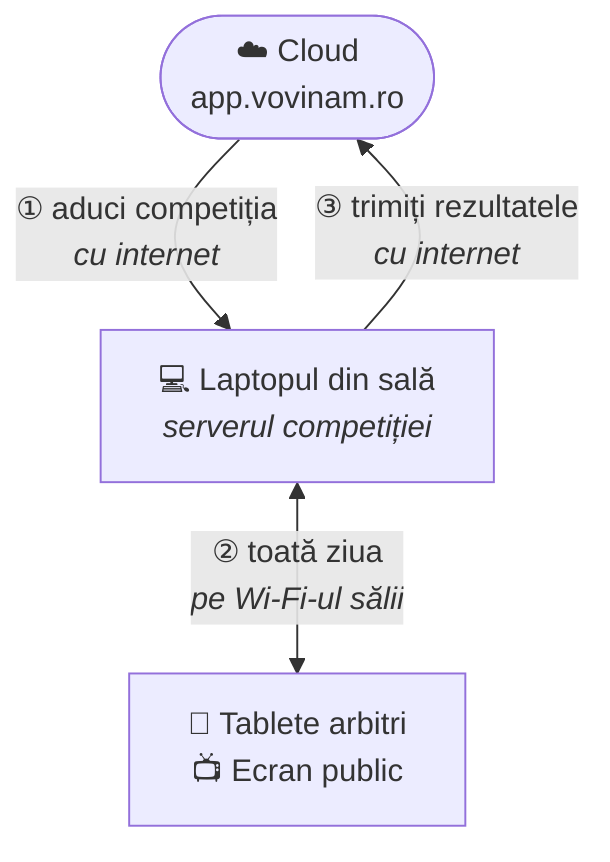
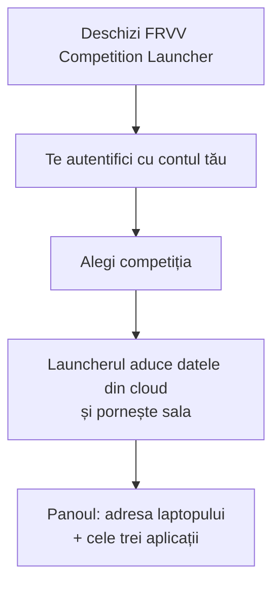
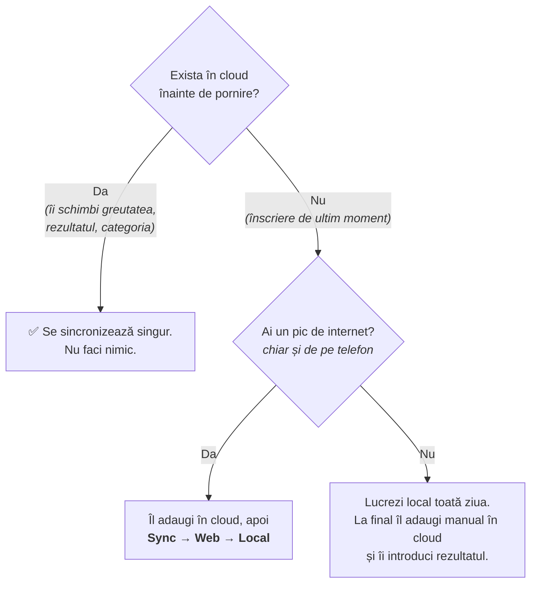
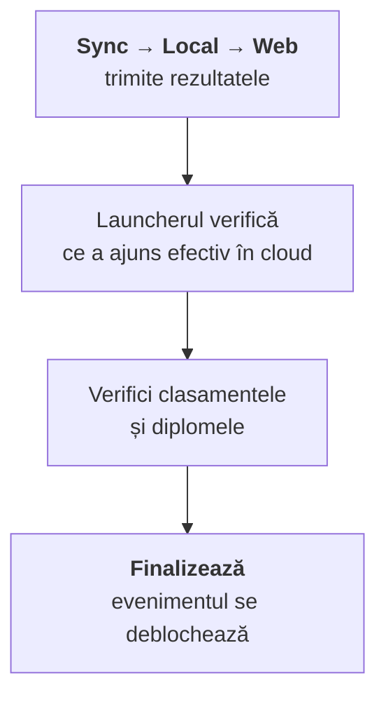

# Competiție pe rețea locală (LAN)

Când sala **nu are internet** (sau are unul nesigur), competiția rulează pe un
laptop din sală. La final, rezultatele se întorc în cloud.



| Rol | Ce face | Când |
|---|---|---|
| 🔧 **Tehnic** | Pregătește laptopul. Două programe, niciun terminal. | O singură dată, cu mult înainte |
| 🧑‍💼 **Operator** | Lucrează în aplicație: secretariat, arbitru șef, organizator. | În ziua competiției |

> 🧑‍💼 Dacă ești operator, sari direct la secțiunea **Ziua competiției**.
>
> 🔧 Pregătirea laptopului are o **variantă ilustrată, pas cu pas**, în aplicație:
> **Competiție în sală** (`/competitie-in-sala`). Acolo sunt desenate ferestrele
> pe care le vezi — folosește-o pe aceea, nu secțiunea de aici.
>
> Pentru arhitectură (dezvoltatori): `docs/LOCAL_EVENT_TECHNICAL_PLAN.md`.

---

## Glosar

| Termen | Înseamnă |
|---|---|
| **Cloud** | Aplicația de pe internet, cea de zi cu zi. Aici stau datele permanent. |
| **Server local** | Laptopul din sală. Ține o copie completă a evenimentului și funcționează fără internet. |
| **Event pack** | Copia evenimentului, trimisă din cloud spre laptop. |
| **Backup** | O „poză" completă a datelor, salvată automat din 15 în 15 minute. |
| **Restaurare** | Revii la o poză salvată mai devreme. |

---

## 🔧 Pregătirea laptopului (o singură dată)

Se instalează **două programe**, atât — fără Node.js, fără terminal, fără codul
sursă.

1. **Docker Desktop** — [docker.com](https://www.docker.com/products/docker-desktop/).
   Lasă-l să pornească odată cu calculatorul.
2. **FRVV Competition Launcher** — butonul de descărcare din pagina
   **Competiție în sală** a aplicației.
3. **Deschide-l o dată.** Nefiind semnată, prima dată sistemul avertizează:
   Mac → clic dreapta → *Deschide*; Windows → *More info* → *Run anyway*.
4. **Pornește sala o dată, cu internet.** Prima pornire descarcă ~1 GB și
   durează ~20 de minute. Următoarele: sub un minut, fără internet.

Gata. Pasul ăsta nu se mai reface la competițiile viitoare.

### Rețeaua sălii

- Router Wi-Fi propriu evenimentului, cu nume și parolă ale lui (ex. `FRVV-EVENT`).
  Internetul pe el e opțional.
- ⚠️ **Oprește „client isolation" / „AP isolation"** din setările routerului.
  Cu ea pornită, tabletele nu văd laptopul — deși totul pare în regulă.
- Toate dispozitivele pe acest Wi-Fi: laptop, tablete, ecrane.

---

## 🧑‍💼 Ziua competiției

### Pornirea



Launcherul face singur tot ce înainte se făcea din terminal. Când aduce
evenimentul, **îl blochează automat în cloud** — nimeni nu mai poate edita acolo
date operaționale (sportivi în categorii, meciuri, arbitri) cât timp lucrezi
local, ca să nu existe două versiuni ale aceluiași lucru.

- [ ] Înainte de pornire: sportivii, cluburile, categoriile, brackets-urile,
      programarea terenurilor și arbitrii sunt complete **în cloud**.

### Adresele din sală

Adresa laptopului o afișează launcherul, mare, în mijlocul panoului.

| Ce deschizi | Adresă | Pe ce |
|---|---|---|
| Administrarea competiției | `http://<adresa-laptopului>:5191` | Laptopul secretariatului |
| Arbitraj | `http://<adresa-laptopului>:5176` | Tabletele arbitrilor |
| Ecran public | `http://<adresa-laptopului>:5177` | Televizorul din sală |

Device-urile Arbitru găsesc laptopul singure, ca `frvv-sala.local` — pe ele nu
se configurează nimic.

### În timpul competiției

Lucrezi exact ca de obicei, doar că vorbești cu laptopul din sală, nu cu
internetul.

**Backup automat la fiecare 15 minute.** Nu faci nimic, rulează singur.

**Dacă greșești și vrei înapoi:** meniul **Sync → Backup-uri și restaurare**,
alegi poza de dinainte de greșeală, *Restaurează*. Înainte de restaurare se
salvează automat starea actuală — deci te poți răzgândi și reveni exact unde erai.

> Înaintea unei operațiuni riscante (ex. regenerare brackets): **Sync → Backup
> acum**, ca reper clar.

---

## ⚠️ Sportiv sau categorie nouă, în timpul competiției

Poți adăuga normal, din aplicație — local nu te oprește nimic. Contează doar cum
se întorc datele în cloud la final:



Sincronizarea de final **nu creează date noi în cloud**, intenționat — doar
actualizează ce exista deja, ca să nu apară duplicate. Dacă încerci totuși,
primești o eroare clară („acest sportiv/categorie nu există în cloud"); nu se
strică nimic, doar acel import nu se face.

> 🔧 Mai există și un buton **„Resincronizează din cloud"** în Sync Center-ul
> aplicației web, care face același lucru de pe server. Cere configurare o
> singură dată: `CLOUD_SYNC_BASE_URL`, `CLOUD_SYNC_USERNAME`,
> `CLOUD_SYNC_PASSWORD` în `.env.local` (vezi `.env.local.example`).

---

## După competiție



**Local → Web se poate repeta oricât** în timpul zilei — trimiți rezultatele de
câte ori vrei, pe măsură ce se termină meciuri.

⚠️ **„Finalizează" se apasă o singură dată, la sfârșit de tot.** După el,
evenimentul se deblochează în cloud și nu mai poți trimite rezultate.

### Dacă sala n-a avut deloc internet

Meniul **Sync → Exportă rezultatele (JSON)…** salvează un fișier. Îl duci pe un
calculator cu internet (email, WhatsApp, stick) și îl încarci din Sync Center-ul
aplicației cloud.

---

## Depanare rapidă

| Problemă | Soluție |
|---|---|
| O tabletă nu se conectează | E pe alt Wi-Fi, sau routerul are „client isolation" pornită. În ordinea asta. |
| Launcherul nu găsește Docker | Docker Desktop nu e pornit. Deschide-l, așteaptă punctul verde „Engine running". |
| Prima pornire se oprește la descărcare | Internet prea slab. Fă prima pornire acasă, nu în sală. |
| Ai restaurat un backup greșit | Restaurează din nou, de data asta poza „Siguranță (înainte de restaurare)", creată automat chiar atunci. |
| Importul de rezultate refuză un sportiv | Normal — vezi secțiunea **Sportiv sau categorie nouă**. |
| Un container e roșu sau repornește mereu | 🔧 În Docker, apasă pe el → *Logs* și trimite ultimele rânduri persoanei tehnice. |

---

## Pe scurt

```
ÎNAINTE:   launcher → alegi competiția → pornește sala  (cloud se blochează singur)
ÎN TIMPUL: totul local, backup automat la 15 min, restaurare oricând
           sportivi/categorii NOI local → nu urcă singuri (vezi secțiunea ⚠️)
DUPĂ:      Sync → Local → Web  →  verifici  →  Finalizează
```

---

## 🔧 Anexă: varianta manuală (calculator cu codul sursă)

Doar pentru un calculator de dezvoltare, care are depozitul descărcat. Pe
laptopul din sală **nu e nevoie de nimic de aici** — launcherul face tot.

Pe un astfel de calculator launcherul folosește `docker-compose.local.yml` și
construiește imaginile din codul de pe disc, iar interfețele pornesc cu
`npm run dev`. Varianta cu `docker-compose.venue.yml` și imagini gata făcute se
folosește acolo unde nu există cod. Vezi `apps/launcher/electron/dockerBackend.js`.

Există și **`Porneste competitia.command`**: dublu-clic pornește Docker Desktop
dacă nu merge deja, apoi deschide launcherul. Trebuie să rămână în folderul
proiectului — pentru o scurtătură pe birou fă un **alias**, nu o copie.

Pornire fără launcher:

```bash
# adresa laptopului în rețea → LAN_HOST în .env.local
ipconfig getifaddr en0                 # macOS   (Windows: ipconfig → IPv4 Address)

docker compose -f docker-compose.local.yml --env-file .env.local up -d --build
docker compose -f docker-compose.local.yml ps
curl http://localhost:8000/health/     # trebuie: {"status": "ok", ...}

./scripts/start-all-apps.sh
```

Atenție: pe ruta asta administrarea e pe **5173**, nu pe 5191 ca la launcher.
Arbitrajul (5176) și ecranul public (5177) rămân aceleași.

Oprire, după finalizarea sincronizării:

```bash
docker compose -f docker-compose.local.yml down
```

Datele rămân salvate. `down -v` le șterge, inclusiv backup-urile — **nu în
timpul unui eveniment real**.
